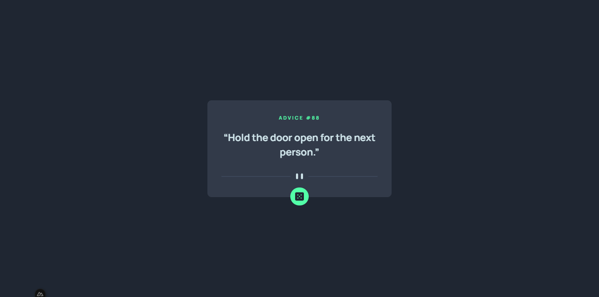

# Frontend Mentor - Advice generator app solution

This is a solution to the [Advice generator app challenge on Frontend Mentor](https://www.frontendmentor.io/challenges/advice-generator-app-QdUG-13db). Frontend Mentor challenges help you improve your coding skills by building realistic projects.

## Table of contents

- [Frontend Mentor - Advice generator app solution](#frontend-mentor---advice-generator-app-solution)
  - [Table of contents](#table-of-contents)
  - [Overview](#overview)
    - [The challenge](#the-challenge)
    - [Screenshot](#screenshot)
    - [Links](#links)
  - [My process](#my-process)
    - [Built with](#built-with)
    - [What I learned](#what-i-learned)
    - [Continued development](#continued-development)
  - [Author](#author)
  - [Nuxt 3 Minimal Starter](#nuxt-3-minimal-starter)
    - [Setup](#setup)
    - [Development Server](#development-server)
    - [Production](#production)

## Overview

### The challenge

Users should be able to:

- View the optimal layout for the app depending on their device's screen size
- See hover states for all interactive elements on the page
- Generate a new piece of advice by clicking the dice icon

### Screenshot




### Links

- Solution URL: [Github repositories](https://github.com/Aldi-H/AdviceGeneratorApp.git)
- Live Site URL: [Add live site URL here](https://cheery-longma-118f12.netlify.app/)

## My process

### Built with

- [Vue](https://vuejs.org/) - JS library
- [Next.js](https://nuxt.com/) - React framework
- [Nuxt Tailwind](https://tailwindcss.nuxtjs.org/) - For styles

### What I learned

In this project, I ventured into the realm of Vue.js and Nuxt 3 for the first time. Vue.js is a progressive JavaScript framework that is widely used for building user interfaces, while Nuxt 3 is a framework for building web applications with Vue.js. The main objective was to explore and apply these technologies to create a web application.

A significant aspect of my learning journey involved fetching data using Nuxt 3. This process typically involves making HTTP requests to retrieve data from an external source and then rendering that data in the application. It was a fundamental step in understanding how to integrate and display dynamic content within the Vue.js and Nuxt 3 framework.

By delving into this project, I gained valuable insights into the fundamentals of Vue.js and Nuxt 3, including how to set up a project, manage components, and perform data fetching. This hands-on experience not only expanded my skill set but also provided a foundation for more complex tasks and projects in the future. Overall, it was a rewarding experience as I took the first steps into the world of Vue.js and Nuxt 3.

### Continued development

For future development, I am keen on delving deeper into Vue.js and expanding my knowledge beyond the basics. One specific area of interest is mastering state management within the Vue.js framework. State management is crucial for handling and managing the application's data and ensuring a seamless flow of information between components.

Vue.js provides various options for state management, such as Vuex, which is specifically designed for managing the state in Vue applications. Exploring and understanding Vuex will enable me to create more complex and robust applications by efficiently managing the shared state among different components.

Additionally, I have set my sights on learning React.js, another popular JavaScript library for building user interfaces. Understanding both Vue.js and React.js will broaden my perspective and skill set in front-end development. While Vue.js and React.js have different approaches and syntax, they share underlying principles, and having proficiency in both will enhance my versatility as a developer.

By combining my continued exploration of Vue.js with the pursuit of React.js knowledge, I aim to become a well-rounded front-end developer capable of handling various projects and challenges. This comprehensive approach to learning will not only strengthen my understanding of JavaScript frameworks but also empower me to make informed decisions when choosing the right technology for different projects in the future.

## Author

- Frontend Mentor - [@Aldi-H](https://frontendmentor.io/profile/Aldi-H)
- Instagram - [\_ald.him](https://www.instagram.com/_ald.him/)

## Nuxt 3 Minimal Starter

Look at the [Nuxt 3 documentation](https://nuxt.com/docs/getting-started/introduction) to learn more.

### Setup

Make sure to install the dependencies:

```bash
# npm
npm install

# pnpm
pnpm install

# yarn
yarn install

# bun
bun install
```

### Development Server

Start the development server on `http://localhost:3000`:

```bash
# npm
npm run dev

# pnpm
pnpm run dev

# yarn
yarn dev

# bun
bun run dev
```

### Production

Build the application for production:

```bash
# npm
npm run build

# pnpm
pnpm run build

# yarn
yarn build

# bun
bun run build
```

Locally preview production build:

```bash
# npm
npm run preview

# pnpm
pnpm run preview

# yarn
yarn preview

# bun
bun run preview
```

Check out the [deployment documentation](https://nuxt.com/docs/getting-started/deployment) for more information.
